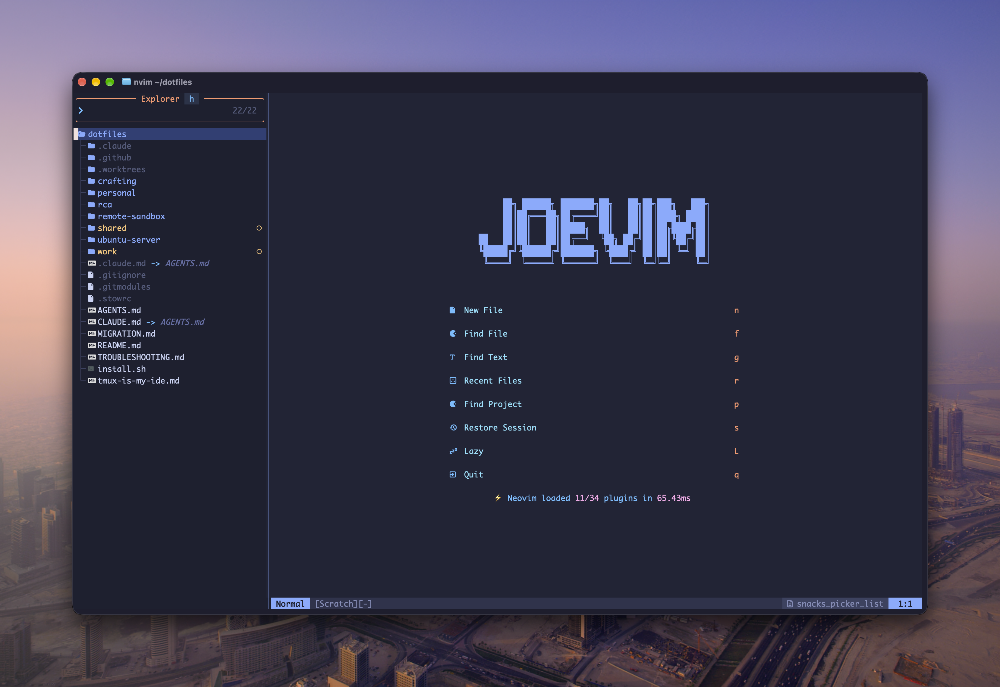

# Neovim Configuration

A bespoke [Neovim](https://neovim.io/) configuration built from scratch on [kickstart.nvim](https://github.com/nvim-lua/kickstart.nvim).



## Why Build From Scratch?

After months of daily-driving [AstroNvim](https://astronvim.com/) and [LazyVim](https://www.lazyvim.org/), I had a config that worked — but I didn't *understand* it. Distros are powerful, but they're someone else's opinions wrapped in layers of abstraction. When something broke, I was debugging framework internals instead of Neovim.

This config is the opposite. Every plugin was added one at a time, tested, understood, and committed individually. The [commit history](https://github.com/josephschmitt/dotfiles/commits/main/shared/.config/nvim) reads like a build log — from stock kickstart.nvim to a full IDE. Nothing is here "because the distro included it." Everything earns its place.

The AstroNvim and LazyVim configs still exist alongside this one (via `NVIM_APPNAME` isolation). They serve as feature references and fallbacks — but this is the daily driver.

## What Makes It Mine

### The Dashboard
A custom ASCII art header in ANSI Shadow style greets you on startup. Not the stock `NEOVIM`, not `AstroNvim` — this is my editor.

### Directory-Aware Startup
Run `nvim some/dir` and instead of the useless netrw file listing you get from stock Neovim, it sets the working directory, opens the Snacks dashboard in the main window, and focuses the file explorer in the sidebar. It required understanding the difference between Snacks dashboard's floating-window mode vs. its in-buffer rendering path — and, later, a race between this opener and the explorer's resize-driven auto-open that used to produce two explorers (the explorer lookup now also counts pickers that were created but haven't rendered yet).

### Pluggable File Explorer
The default explorer is the **Snacks explorer** (a picker in sidebar layout), but nothing else in the config knows that. `lua/custom/config.lua` exposes an adapter (`config.filetree.{open,close,toggle,focus,reveal,open_cwd,restore,reload,wipe_buffers}`) and `filetree_provider` picks the backend: `"snacks"` (default), `"neo-tree"`, or `"nvim-tree"`. Swapping explorers is a one-line change; the statusline offset, bufferline offset, session cleanup, and dashboard opener all go through the adapter.

`<Leader>o` jumps between the explorer and your last window, and reopens the explorer in whichever state you last had it — revealing the current file, or rooted at the cwd. Snacks pickers can't be hidden and restored, so that state is tracked by the adapter.

### Performance-First Plugin Loading
Dashboard startup loads only ~5 plugins in ~50ms. The entire LSP chain (lspconfig + mason + fidget + blink.cmp), treesitter, gitsigns, bufferline, and which-key all defer until you actually open a file or start typing. LazyVim achieves 33ms with a purpose-built lazy-loading framework; we get close with just careful `event` triggers on stock lazy.nvim.

### Smart Behaviors
- **Winbar** only appears when you have multiple splits (no wasted space with one window)
- **Bufferline** hides when only one buffer is open
- **File explorer** auto-opens on wide screens and closes on narrow ones (threshold is `filetree_auto_close_width` in `config.lua`); hidden files are shown
- **mini.indentscope** uses a `draw.predicate` to skip non-file buffers — autocmd-based approaches lose the race against dashboard buffer initialization
- **Missing directories on save** — `:w path/to/new/file` prompts to create the missing parent directories instead of failing with `E212`. Answering "No" lets the write fail as it normally would, so nothing is created behind your back (also ported to `shared/.vimrc`)
- **SSH clipboard** — yanks over SSH (e.g. `remote-sandbox` boxes, which have no `xclip`/`wl-copy`) use the OSC-52 provider directly, so they reach the local terminal's clipboard without needing tmux or a clipboard binary on the remote box. Details worth knowing:
  - Detected via `SSH_TTY`, other SSH env vars (sshd doesn't always set `SSH_TTY`), and `herdr --remote` sessions
  - Real OSC-52 *paste* is deliberately not wired up — it queries the terminal and hangs on "Waiting for OSC 52…" in most terminals. A local-register paste stub stands in (Neovim rejects a `g:clipboard` without a `paste` entry), so `p`/`P` stay instant and preserve the register's linewise/charwise type
- **Format on paste** — `p`/`P` (normal and visual, any register, any count) run conform.nvim on just the pasted lines afterward, so pasted code picks up local indentation/style automatically. The formatters it relies on (`stylua`, `gofumpt`, `prettierd`) are auto-installed via Mason
- **Native commenting replaced** — [celeste_comment.nvim](https://github.com/celeste3z/celeste_comment.nvim) takes over from the built-in `vim._comment` for block comments, sticky cursor, and tree-sitter-aware comment strings (JSX/TSX, Vue). Requires Neovim 0.12+
- **GUI-friendly PATH** — user bin dirs are prepended to `PATH` so GUI-launched Neovim finds the same tools as a shell-launched one
- **Visual `<` / `>` are repeatable** — the selection is kept after indenting, so `>>>` or `.` keep going

### Unified Keybinding Philosophy
AstroNvim's keybinding structure was the starting point, but adapted to be more discoverable. Everything lives under `<Space>` with which-key's helix-style popup. Icons are embedded directly in group names (a workaround for `icons.mappings=false` blocking explicit icon properties). LSP, surround, comment, and transform actions use Neovim's native `g` prefixes instead of `<Leader>`.

## Launch

```bash
nvim              # Default (no NVIM_APPNAME needed)
vim               # Alias — same config
lazyvim           # LazyVim config (NVIM_APPNAME=lazyvim)
astrovim          # AstroNvim config (NVIM_APPNAME=astronvim)
```

On machines without Neovim, `shared/.vimrc` is a plain-Vim port of the options, built-in keybindings, and colorscheme from this config (LSP/treesitter/etc. are intentionally not ported).

## Architecture

Stock `init.lua` from kickstart.nvim with all customizations in `lua/custom/`. Each plugin file is one feature, one concern. When a custom file references the same plugin as `init.lua`, lazy.nvim merges the specs — so custom `opts` and `config` override stock ones without modifying the upstream file.

```
lua/custom/
├── config.lua                  # Shared constants + file explorer adapter (snacks / neo-tree / nvim-tree)
├── lsp-servers.lua             # LSP servers to enable (lspconfig names)
└── plugins/
    ├── ai.lua                  # Claude Code integration
    ├── bufferline.lua          # Tab bar with ordinal numbers
    ├── cmdline.lua             # Command-line completion
    ├── colorscheme.lua         # Tokyonight moon + custom highlights
    ├── comment.lua             # celeste_comment (line + block commenting)
    ├── dashboard.lua           # Snacks dashboard config
    ├── diagnostics.lua         # Powerline-style inline diagnostics
    ├── filetree.lua            # Explorer specs (snacks default; neo-tree / nvim-tree alternates)
    ├── flash.lua               # Label-based jump motions
    ├── format-on-paste.lua     # Auto-format pasted text (p/P)
    ├── formatter-auto-install.lua # Auto-installs conform's non-LSP formatters
    ├── git.lua                 # Gitsigns, mini.diff, diffview, lazygit, gitlinker
    ├── indent-blankline.lua    # Static indent guides (all levels)
    ├── keymaps.lua             # Core keybindings (jk escape, scrolling, etc.)
    ├── mason-auto-install.lua  # On-demand LSP server installation
    ├── mini.lua                # Statusline, surround, text objects, move, indentscope
    ├── multicursor.lua         # Multi-cursor editing
    ├── notifier.lua            # Toast notifications
    ├── options.lua             # Vim options, SSH clipboard, netrw replacement, autocmds
    ├── persistence.lua         # Session save/restore with explorer cleanup
    ├── picker.lua              # Snacks picker (replaced Telescope) + LSP pickers
    ├── pj.lua                  # Project jumping
    ├── sortjson.lua            # JSON key sorting
    ├── tmux-navigator.lua      # Seamless Ctrl+hjkl between tmux/nvim
    ├── toggles.lua             # Toggle keybindings (format, wrap, hints, etc.)
    ├── transforms.lua          # `gx` group: case, boolean, increment/decrement
    ├── which-key.lua           # Helix-style popup with icon groups
    └── zen-center.lua          # Center buffer with padded side buffers (no-neck-pain)
```

### LSP and Formatting

- Servers are listed in `lsp-servers.lua` (currently `ts_ls`, `jsonls`, `yamlls`, `gopls`, `rust_analyzer`, `marksman`, plus `lua_ls` in `init.lua`) and enabled with `vim.lsp.enable()`.
- `mason-auto-install` installs each server the first time its filetype is opened. It needs **Mason registry names** (e.g. `json-lsp`, not `jsonls`) listed explicitly — it does not read `lsp-servers.lua`.
- Formatting uses conform.nvim with LSP fallback: `grf` to format, format-on-save on by default (`<Leader>tf` buffer / `<Leader>tF` global toggle).

## Plugins

| Plugin | Purpose | Loads |
|--------|---------|-------|
| tokyonight.nvim | Colorscheme (moon style) | Startup |
| snacks.nvim | Dashboard, picker, file explorer, notifications, lazygit | Startup |
| mini.nvim | Statusline, surround, text objects, move, indentscope | Startup |
| nvim-lspconfig | Language server support | File open |
| mason.nvim + mason-auto-install | LSP install (on-demand per filetype) | With LSP |
| mason-tool-installer + formatter-auto-install | Formatter install (`stylua`, `gofumpt`, `prettierd`) | Startup (must precede `VimEnter`) |
| nvim-treesitter | Syntax highlighting | File open |
| blink.cmp | Autocompletion (insert + cmdline) | Insert / cmdline |
| bufferline.nvim | Tab bar with ordinal numbers | Second buffer |
| gitsigns.nvim | Git gutter signs + hunk operations | File open |
| mini.diff | Inline diff overlay | File open |
| diffview.nvim | Full-screen side-by-side diff viewer | On command |
| gitlinker.nvim | Generate GitHub permalinks for current line/selection | On keypress |
| which-key.nvim | Keybinding popup (helix preset) | VeryLazy |
| flash.nvim | Label-based jump motions | VeryLazy |
| claudecode.nvim | Claude Code WebSocket integration | VeryLazy |
| persistence.nvim | Session save/restore per directory | File open |
| conform.nvim | Format on save + format on paste | File save / first paste |
| indent-blankline.nvim | Static indent guides at every level | File open |
| tiny-inline-diagnostic.nvim | Powerline-style diagnostic messages | VeryLazy |
| multicursor.nvim | Multi-cursor editing | On keypress |
| vim-tmux-navigator | Ctrl+hjkl across tmux and nvim splits | On keypress |
| no-neck-pain.nvim | Center buffer with padded side buffers | On command |
| celeste_comment.nvim | Line/block commenting (Neovim 0.12+) | On keypress |
| sortjson.nvim | Sort JSON keys | On command |
| pj.nvim | Project switcher | On command |
| neo-tree.nvim / nvim-tree.lua | Alternate explorers (only if selected in `config.lua`) | On keypress |

Telescope is explicitly disabled — Snacks picker replaced it.

## Key Bindings

Leader key: **Space**

| Key | Action |
|-----|--------|
| `<Leader>s` | Save buffer |
| `<Leader>c` | Close buffer |
| `<Leader>q` | Quit window |
| `Q` | Quit Neovim |
| `<Leader>h` | Home screen (dashboard) |
| `<Leader>n` | New file |
| `<Leader>r` | Rename file |
| `<Leader><Space>` | Smart picker |
| `<Leader>ff` / `fg` / `fb` / `fr` | Find files / grep / buffers / recent |
| `<Leader>fw` | Find current word (normal + visual) |
| `<Leader>fp` | Find projects (pj) |
| `<Leader>f.` | Resume last picker |
| `<Leader>/` | Search current buffer |
| `<Leader>ee` | Toggle explorer (reveals current file) |
| `<Leader>eE` | Toggle explorer (rooted at cwd) |
| `<Leader>er` | Refresh explorer |
| `<Leader>o` | Toggle focus between explorer and last window |
| `j` / `k` | Move by display line (logical with a count, e.g. `5j`) |
| `J` / `K` | Scroll viewport down / up (2 lines, mousewheel-style; also `PageDown`/`PageUp`) |
| `<Leader>J` | Join lines (was `J`) |
| `<Leader>K` | LSP hover (was `K`) |
| `gh` / `gl` | Start / end of line |
| `gV` | Select all |
| `U` | Redo |
| `jk` / `kj` / `jj` | Exit insert mode |
| `Alt+Backspace` | Delete word backwards (insert mode) |
| `<` / `>` | Indent line; in visual mode keeps the selection |
| `S-h` / `S-l` | Previous / next buffer |
| `Ctrl+1-9` | Jump to buffer by number |
| `<Leader>bd` / `<Leader>bD` | Close current buffer / pick one from the tabline to close |
| `<Leader>gs` / `gr` | Stage / reset git hunk |
| `<Leader>gd` | Toggle diff overlay |
| `<Leader>gv` / `gH` | Diffview open / current-file history |
| `<Leader>gg` / `gl` | Lazygit / lazygit log |
| `<Leader>gy` | Yank GitHub permalink (visual = line range) |
| `<Leader>gG` | Open GitHub permalink in browser |
| `<Leader>ac` | Launch Claude in tmux split |
| `gra` / `grn` / `grf` | LSP code action / rename / format |
| `grd` / `grr` / `gri` / `grt` | LSP definition / references / implementation / type (Snacks pickers) |
| `gsa` / `gsd` / `gsr` | Surround add / delete / replace |
| `gcc` / `gc` | Toggle line comment (line / motion or selection) |
| `gbc` / `gb` | Toggle block comment (line / motion or selection) |
| `gco` / `gcO` / `gcA` | New comment below / above / at end of line |
| `Ctrl+C` | Toggle comment (line in normal, selection in visual) |
| `gxu` / `gxU` / `gx~` | Lowercase / uppercase / toggle case of word |
| `gxt` | Toggle boolean (`true`/`false`, `yes`/`no`, `on`/`off`, …) |
| `gx+` / `gx-` | Increment / decrement number |
| `go` | Open URL/filepath under cursor |
| `<Leader>tf` / `tF` | Toggle format-on-save (buffer / global) |
| `<Leader>tz` | Toggle center focus (padded sides + wrap) |

`<Leader>t` also holds toggles for wrap, line/relative numbers, spell, diagnostics, inlay hints, autocompletion, color column, conceal, and syntax highlighting.

Press `<Space>` and wait for the which-key popup to see everything.

## Performance

Dashboard loads **~5 plugins** in **~50ms**. Everything else is lazy-loaded:

- **File-editing plugins** (LSP, treesitter, gitsigns, indent guides) load on `BufReadPost`
- **Completion** loads on `InsertEnter`
- **UI chrome** (which-key, diagnostics, flash) loads on `VeryLazy`
- **On-demand tools** (diffview, multicursor, celeste_comment) load on first keypress or command

Run `:Lazy` to see plugin load timing and counts.
